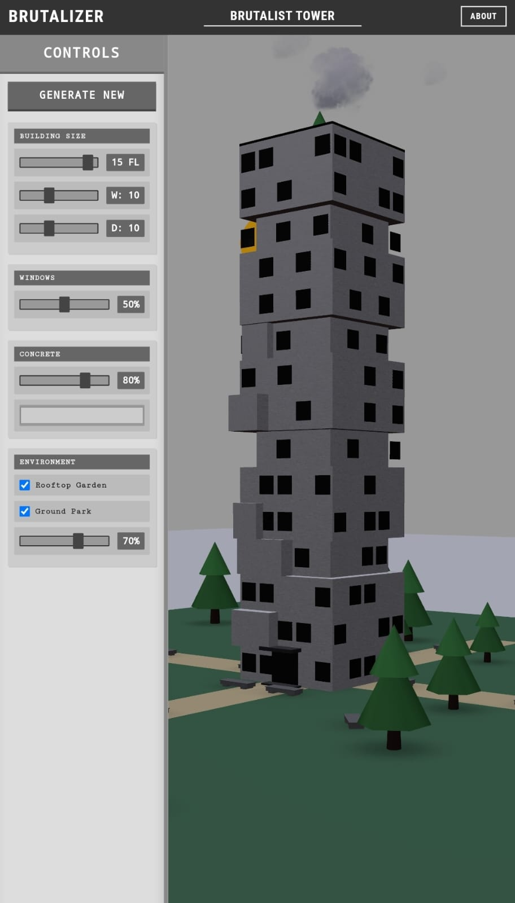

# BRUTALIZER - Brutalist Building Generator

A web-based 3D brutalist building generator built with React, Three.js, and React Three Fiber.



## About

BRUTALIZER allows you to generate and customize brutalist architecture in 3D. Inspired by the raw concrete forms and geometric shapes of brutalist buildings from the 1960s to 1980s, this tool lets you create your own brutalist masterpiece.

## Features

- Generate random brutalist buildings with procedural algorithms
- Customize building parameters (floors, dimensions, window density)
- Adjust concrete texture and color
- Place windows and doors
- Capture and share your creations
- Fully interactive 3D environment

## Technologies Used

- React
- Three.js
- React Three Fiber
- React Three Drei
- Styled Components
- HTML-to-Image (for capturing screenshots)

## Getting Started

### Prerequisites

- Node.js (v14 or higher)
- npm or yarn

### Installation

1. Clone the repository:
```
git clone https://github.com/yourusername/brutalist.git
cd brutalist
```

2. Install dependencies:
```
npm install
```

3. Start the development server:
```
npm run dev
```

4. Open your browser and navigate to `http://localhost:5173`

## Usage

1. Use the control panel on the left to adjust building parameters
2. Click "Generate New" to create a new random building with your parameters
3. Rotate, zoom, and pan to view your building from different angles
4. Click "Capture" to take a screenshot of your creation
5. Name your building and share the image

## Building for Production

To create a production build:

```
npm run build
```

The built files will be in the `dist` directory.

## License

This project is licensed under the ISC License - see the LICENSE file for details.

## Acknowledgements

- Inspired by brutalist architecture from the 1960s-1980s
- Built with [React Three Fiber](https://github.com/pmndrs/react-three-fiber)
- Uses [React Three Drei](https://github.com/pmndrs/drei) for 3D helpers 